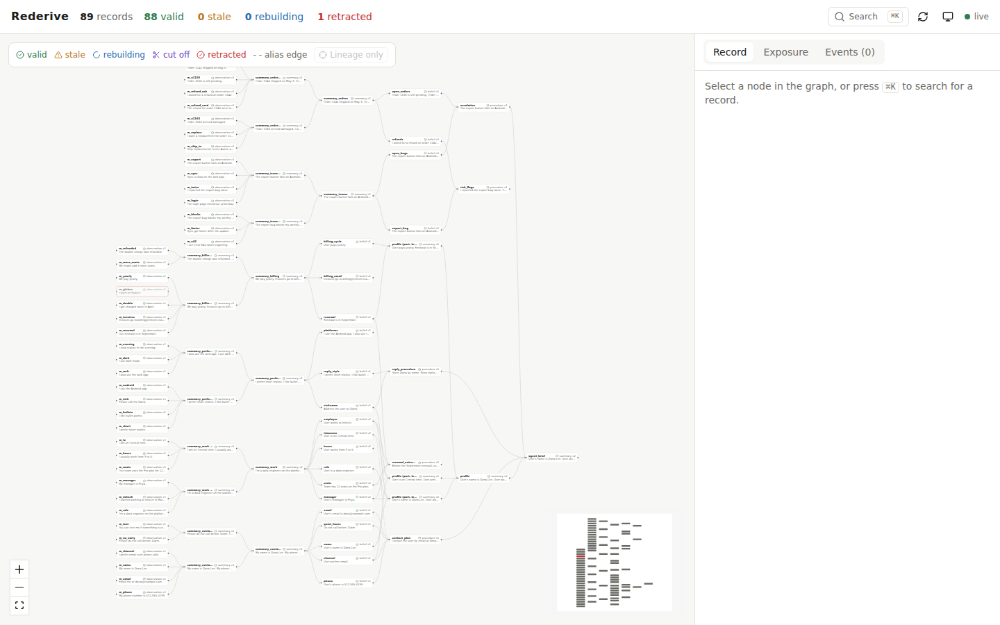
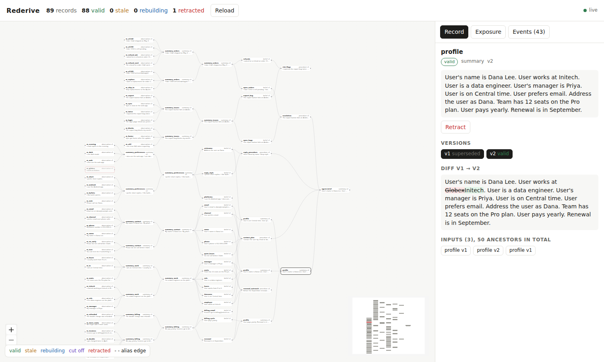
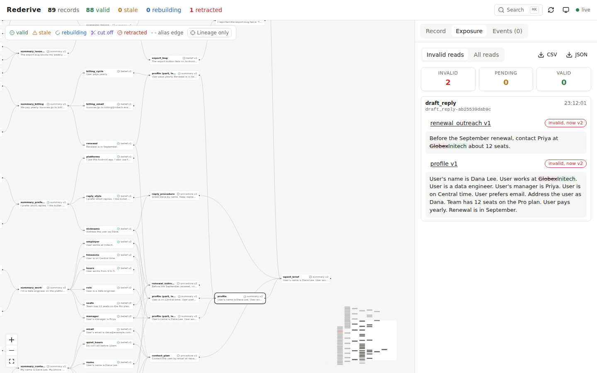

# Rederive

Rederive is agent memory where every derived record knows how it was made. Each summary, belief, or procedure stores its exact input versions and the recipe that produced it. When a memory turns out to be wrong, you retract it. Rederive marks every descendant stale, rebuilds them in topological order, stops rebuilds early when the output doesn't change, and lists the past tool calls that acted on bad data.

It applies build-system and database ideas (lineage, incremental recompute, early cutoff, fencing tokens) to one question: what happens when a memory is wrong?



## The demo

The demo seeds one user with 40 support-chat messages and derives 49 records from them: topic summaries, beliefs, a profile, and procedures. One message is wrong. The agent stored "I work at Globex." from a transcript where the user was talking about a vendor.

```
$ make demo
seeded 40 observations and 49 derived records: {'observation': 40, 'summary': 23, 'belief': 21, 'procedure': 5}

profile v1:
  User's name is Dana Lee. User works at Globex. User is a data engineer. ...

tool call draft_reply-... read 3 records:
  [plan] Before the September renewal, contact Priya at Globex about 12 seats.

retracting the wrong message: 'I work at Globex.'
  14 records went stale
  rebuilt 7, stopped by early cutoff 7 (cut_off 5, skipped 2)

profile diff v1 -> v2:
  -User works at Globex.
  +User works at Initech.

exposure report (tool calls that read now-invalid versions):
  draft_reply-... read procedure v1 (invalid, latest v2)
  draft_reply-... read summary v1 (invalid, latest v2)
```

Of the 14 stale records, 7 were rebuilt with new content. 5 were rebuilt and judged equivalent, so they stopped the cascade (the role, manager, timezone, hours, and seats beliefs all come from the work summary but don't mention the employer). 2 never ran a recipe because every input was unchanged in content.

Watch the 2-minute walkthrough: [docs/demo.webm](docs/demo.webm). It runs on Claude (`REDERIVE_LLM=anthropic`), so every summary, belief, rebuild, and equivalence check in it is a real model call. It seeds the graph, shows the profile, runs a tool call, retracts the wrong message in the UI, follows the rebuild cascade, and ends on the diff and the exposure report. Model output varies between runs. The recorded run rebuilt 9 records, cut off 3, and skipped 2.

| Profile diff | Exposure report |
|---|---|
|  |  |

## Quick start

Docker:

```
docker compose up --build
# UI  http://localhost:3000
# API http://localhost:8000/docs
docker compose exec server python -m demo_agent.support_agent
```

Local, with Postgres 16 and Redis running:

```
make install
export DATABASE_URL=postgresql://postgres@localhost:5432/rederive
make server      # terminal 1
make worker      # terminal 2 (run more than one if you like)
make ui          # terminal 3
make demo        # seeds data and replays the wrong-employer story
make scenarios   # runs scenarios/*.yaml against the server
make test        # 31 tests, needs a rederive_test database
```

The default LLM is a deterministic offline provider, so everything runs without an API key. To use Claude:

```
export REDERIVE_LLM=anthropic ANTHROPIC_API_KEY=...
```

Recipes then run on `claude-sonnet-5` at low effort. Equivalence and paraphrase checks run on `claude-haiku-4-5` at temperature 0. Sonnet 5 rejects sampling parameters, so low effort is how recipe output stays short and stable.

### Re-recording the video

```
export REDERIVE_LLM=anthropic ANTHROPIC_API_KEY=...
REDERIVE_REBUILD_DELAY=0.6 make worker   # one worker, slowed so each state shows on screen
make server                              # and make ui, in other terminals
make record                              # writes docs/demo.webm
```

`REDERIVE_REBUILD_DELAY` makes a worker pause after it marks a record `rebuilding`. It defaults to 0 and exists only for demos. The script waits for the rebuild queue to drain before it shows the tally, so slower model calls do not cut the cascade short. Seeding takes about 80 seconds on Claude. The script uses Playwright. Set `CHROMIUM_PATH` to use a specific browser binary.

## Architecture

```
  agent code
      |
      v
 +-----------+   observe / derive / read    +------------------+
 |  SDK      | ---------------------------> |  FastAPI server  |
 +-----------+                              +------------------+
      | tool call reads                          |        |
      v                                          v        v
 +-----------+                         +-------------+  +------------+
 | exposure  | ----------------------> | PostgreSQL  |  | Redis      |
 | log       |                         | records     |  | rebuild    |
 +-----------+                         | edges       |  | queue      |
                                       | recipes     |  +------------+
   retract(id)                         | exposures   |        |
      |                                +-------------+        v
      v                                      ^         +--------------+
 +---------------+  mark stale (CTE walk)    |         | rebuild      |
 | invalidate.py | --------------------------+         | workers      |
 +---------------+  enqueue in topo order -----------> | LLM + cutoff |
                                                       +--------------+
                                                              |
                                              NOTIFY rebuilt / stopped
                                                              v
                                                       +--------------+
                                                       | Next.js UI   |
                                                       +--------------+
```

Postgres is the source of truth for records, edges, and job state. Redis only orders the work. A worker sweep re-queues anything Redis lost.

## Repository

```
sdk/rederive/        client.py (observe, derive, retract, correct, delete, read, lineage, diff)
                     recipes.py (recipe hashing, registry), exposure.py (@exposed decorator)
server/app.py        FastAPI routes and the /events WebSocket
server/memory.py     the operations behind each route
server/db/           schema.sql, queries.py (recursive CTEs), pool.py
server/invalidate.py retraction walk
server/workers/      rebuild.py (fenced topological rebuild), queue.py (Redis)
server/cutoff.py     semantic early cutoff
server/verify.py     deletion verifier
server/fanin.py      bounded fan-in summary trees
server/llm.py        FakeProvider and AnthropicProvider
ui/                  Next.js, React Flow graph, word diff, exposure report, live events
scenarios/           wrong_employer, delete_phone, fanout_summary
demo_agent/          40-message seed and the support agent
eval/                run_scenarios.py, cutoff_pairs.jsonl (50 labeled pairs), tune_cutoff.py
tests/               pytest suite
```

## API

```
POST /records/observe                {text, meta} -> {id, version}
POST /records/derive                 {inputs: ["id" | "id@version"], recipe, kind, meta, fan_in_k?, target_id?}
POST /records/{id}/retract           -> {stale_count, job_ids, stale}
POST /records/{id}/correct           {text} -> {version, stale_count, job_ids}
POST /records/{id}/delete            {payload?} -> adds must_not_contain constraints, retracts
GET  /records/{id}?version=&tool_call_id=&tool_name=    410 if deleted
GET  /records/{id}/versions
GET  /records/{id}/lineage?version=
GET  /records/{id}/diff?from=1&to=2
GET  /records/{id}/deletion_report
GET  /exposure?stale_only=true
GET  /graph, /jobs, /events/recent
WS   /events                         stale, rebuilding, rebuilt, cut_off, skipped, retracted, failed
```

SDK:

```python
from rederive import Rederive, Recipe, exposed

mem = Rederive("http://localhost:8000")
a = mem.observe("I work at Globex.", user="dana")
b = mem.observe("I started working at Initech in March.", user="dana")
work = mem.derive([a, b], Recipe("Summarize the user's job.\n{inputs}"), kind="summary")

@exposed(mem)
def draft_reply():
    return mem.read(work["id"])["text"]   # logged as an exposure

mem.retract(a["id"])
mem.wait_idle()
mem.exposures(stale_only=True)          # draft_reply read a version that is now invalid
```

## How it works

Record versions are immutable. A rebuild or correction inserts a new version and flips the old one to `superseded`, or to `equivalent` if the early cutoff judged it the same.

**Retraction walk.** A recursive CTE walks `edge` from the retracted versions to every descendant that is the latest version of its record. Each node keeps its longest path depth, so ordering by depth is a topological order. Every descendant is marked `stale`, gets a new fence token, and gets a rebuild job at its depth.

**Fenced rebuild.** A worker claims a job, waits if any parent is still stale, and resolves each parent to its latest valid version. It runs the recipe outside any transaction, then writes the new version only if the record's fence token still matches the job's. A second retraction during a rebuild bumps the token, and the late output is discarded. `test_late_worker_output_is_discarded` fires a correction from inside the LLM call to prove it.

**Early cutoff.** Two levels:

1. Before running a recipe, the worker compares each parent's current `content_version` with the one the child was built from. If none changed in content, the child goes back to `valid` with alias edges to the new parent versions and no LLM call. The job ends as `skipped`.
2. After a rebuild, `cutoff.py` compares the old and new text. Identical text is equal. Otherwise it computes a claim-level similarity, which matches each sentence to its closest sentence on the other side and keeps the weakest match. Below 0.85 counts as different. At or above 0.97 counts as equal. Between the two, a small model decides whether any claim differs. An equal result keeps the old `content_version`, so children skip.

Whole-document cosine was the first design and it failed in the demo. Swapping "Globex" for "Initech" in a 10-sentence profile scored above 0.97 and the profile was wrongly cut off. Dropping 1 of 16 facts scored 0.998. Claim-level similarity drops sharply in both cases, and there are unit tests for each.

**Deletion.** `delete` stores the record text plus any detected phone numbers and emails as `must_not_contain` constraints, retracts the record, and overwrites its text with `[deleted]`. Every rebuild and derive checks its output with an exact match, a normalized match (lowercase, letters and digits only, so `(512) 555 0199` matches `512-555-0199`), and a paraphrase check by the model. On a hit it retries once with an explicit exclusion instruction. If the retry still leaks, the job fails, the record stays `stale`, and a `failed` event fires. `deletion_report` shows which check fired on which attempt, plus residual observations that still contain the payload. Observations are user input, so Rederive reports them and does not rewrite them.

**Bounded fan-in.** A summary over more than k inputs (default 8) is built as a tree of partial summaries. With 64 inputs and k=4, retracting one input rebuilds 3 nodes, and each rebuild reads at most 4 inputs.

**Exposure.** `@exposed` gives each tool call an id. Reads inside it pass the id to the server, which logs `(tool_call_id, record_id, version)`. A read is `valid` if the record's latest version is valid with the same `content_version`, `pending` while a rebuild is in flight, and `invalid` otherwise.

**Cycles.** New records get new ids, so plain derives cannot form a cycle. `derive(..., target_id=X)` writes a new version of an existing record, and it is rejected with 409 if X is an input or an ancestor of an input. Reflections are versioned as new records: reflection v2 reads reflection v1.

## Evaluation

`python eval/run_scenarios.py`:

```
PASS  delete_phone    delete: 13 stale | jobs: {'done': 6, 'skipped': 3, 'cut_off': 4}
PASS  fanout_summary  retract: 3 stale | jobs: {'done': 3}
PASS  wrong_employer  retract: 14 stale | jobs: {'done': 7, 'skipped': 2, 'cut_off': 5}
```

All three also pass with 3 workers running at once.

`python eval/tune_cutoff.py` runs the cutoff over 50 hand-labeled pairs (25 equal, 25 different) on a grid of thresholds. With the offline hashing embedder and the fake judge, the default thresholds give:

| | rate |
|---|---|
| false-equal (a missed rebuild) | 0% (0 of 25) |
| false-different (a wasted rebuild) | 40% (10 of 25) |

The false-differents are synonyms and paraphrases ("joined" and "started at") that a hashed bag of words and an exact sentence-set judge cannot see. The tuner ranks false-equal first because a missed rebuild leaves wrong content in memory, while a wasted rebuild only costs an LLM call. Run it with `REDERIVE_LLM=anthropic` and `REDERIVE_EMBEDDER=sentence-transformers` to measure the real stack. Those numbers are not measured yet.

## Design notes

- `record.embedding` is `real[]`, not pgvector's `vector(1536)`. The cutoff compares two versions of one record, so it needs no index. This keeps the server on plain Postgres. The embedders produce 384 dimensions.
- Rebuilds keep input order from derive time (`edge.position`), so a recipe sees its inputs in a stable order.
- Exact-text checks in `scenarios/*.yaml` assume the fake provider. The `contains` and `not_contains` checks also work with Claude.

## Out of scope

Cycles in the graph, multi-tenant auth, and backends other than Postgres.
